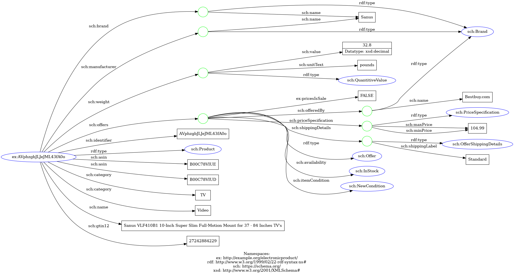

# Web sémantique - Projet DANA
*Année universitaire 2022-2023.*

Sujet : [Projet Dana: Open Data in the Cloud of Linked Data](https://docs.google.com/document/d/1QL7D6zpCqcbWIOy2oitHO7SfcmTnf1Ps1ncrEOEwWZE/edit)

Site partagé du projet : [DanaInfoPartage](https://docs.google.com/document/d/1dBG-1cdKs59BGM9Qbfp-xvqpxYxkPYj1zKUxr_QZ4b0/edit)

## Groupe 8
- Marius GUITTON-FRANTZ
- Mathis DUPUIS
- Gaëtan REINHARDT

## Electronic Products and Pricing Data
Source : [Datainfinity](data.world/datafiniti/electronic-products-and-pricing-data)

Slides : [Web sémantique - Groupe 8](https://docs.google.com/presentation/d/1T6nMpp9C3K_5w6DpYw430Im0jwAyvkJCqinKOH8bGU8/edit#slide=id.g15941187b6a_0_1790)

Schéma :

[]
